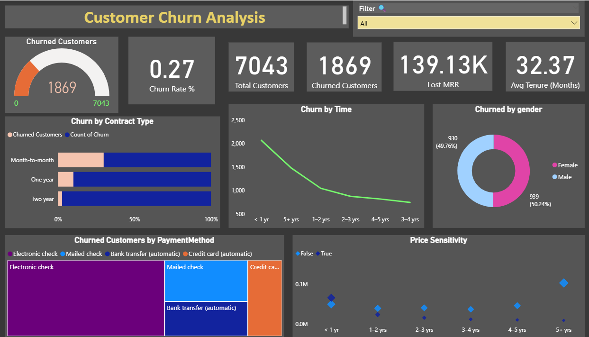
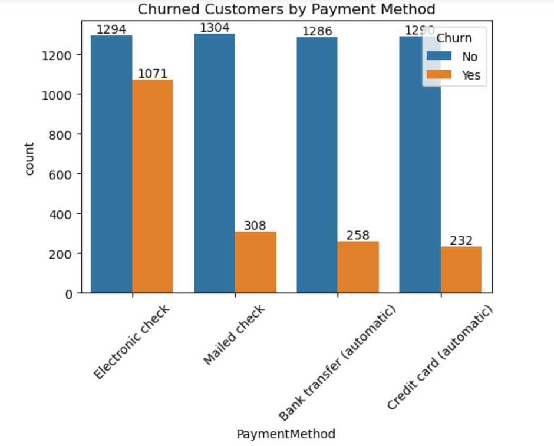
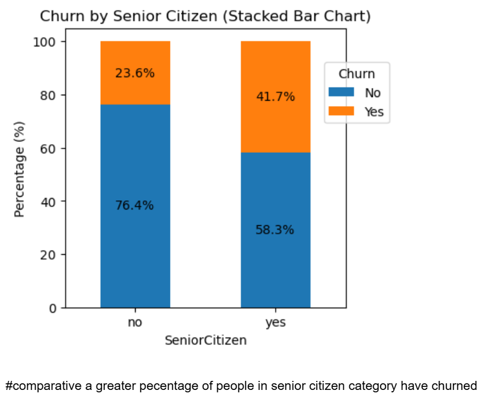
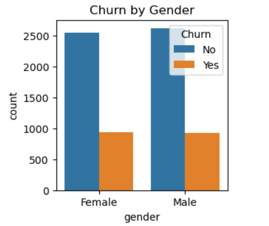

# 📊 Telco Customer Churn Analysis

A comprehensive data analysis project to understand customer churn patterns and identify key factors influencing customer retention in the telecommunications industry.

## 📌 Project Overview

This project performs an in-depth analysis of telco customer churn data to help businesses understand why customers leave and develop effective retention strategies. The analysis combines exploratory data analysis (EDA) with interactive dashboard visualizations to provide actionable insights for reducing churn rates and improving customer lifetime value.

The dataset contains **7,043 customer records** with comprehensive information about customer demographics, account details, service usage patterns, and churn behavior. Through statistical analysis and data visualization, this project identifies critical churn drivers and provides data-driven recommendations for customer retention.

## 🛠️ Technologies Used

### **Data Analysis & Processing**
- **Python** - Core programming language for data analysis
- **Pandas** - Data manipulation, cleaning, and preprocessing
- **NumPy** - Numerical computations and statistical operations
- **Jupyter Notebook** - Interactive development environment for EDA

### **Data Visualization & Dashboards**
- **Power BI** - Interactive dashboard creation and business intelligence
- **DAX (Data Analysis Expressions)** - Advanced calculations and measures in Power BI
- **Matplotlib** - Statistical plotting and data visualization in Python
- **Seaborn** - Advanced statistical data visualization

### **Statistical Analysis**
- **Python Statistical Libraries** - Correlation analysis, hypothesis testing
- **Data Profiling** - Understanding data distributions and patterns
- **Exploratory Data Analysis (EDA)** - Comprehensive data exploration and insights

## 🗂️ Dataset

The dataset contains **7,043 customer records** with **21 features** including:
- **Customer Demographics**: Gender, SeniorCitizen status, Partner, Dependents
- **Account Information**: Tenure, Contract type, Payment method, Monthly charges, Total charges
- **Service Details**: Phone service, Internet service, Online security, Tech support, Streaming services
- **Target Variable**: Churn (Yes/No)


## 📊 Key Analysis & Insights

### **📈 Interactive Dashboard Overview**


**Dashboard Key Metrics:**
- **Churn Rate**: 26.54% (1,869 out of 7,043 customers)
- **Total Customers**: 7,043
- **Churned Customers**: 1,869
- **Lost MRR**: $139.13K in monthly recurring revenue
- **Average Tenure**: 32.37 months

### **💳 Churn by Payment Method Analysis**


**Payment Method Insights:**
- **Electronic Check**: Highest churn count (~1,071 customers)
- **Mailed Check**: Moderate churn (~308 customers)
- **Bank Transfer (Automatic)**: Lower churn (~258 customers)
- **Credit Card (Automatic)**: Lowest churn (~232 customers)

**Key Finding**: Electronic check users represent the highest risk group, suggesting payment convenience and reliability issues.

### **👴 Churn by Senior Citizen Status**


**Senior Citizen Analysis:**
- **Senior Citizens**: **41.7% churn rate** (significantly higher)
- **Non-Senior Citizens**: **23.6% churn rate**
- **Comparative Impact**: Senior citizens are **76% more likely to churn**

**Key Finding**: Age demographics significantly impact customer retention, with senior customers requiring specialized attention.

### **👥 Churn by Gender Distribution**


**Gender-Based Insights:**
- **Female Customers**: ~930 churned (49.76% of total churn)
- **Male Customers**: ~939 churned (50.24% of total churn)
- **Distribution**: Nearly equal churn distribution across genders

**Key Finding**: Gender shows minimal impact on churn behavior, indicating other factors are more significant.

## 🔍 Major Insights Captured

### **📋 Contract Type Impact**
- **Month-to-month contracts**: **Highest churn risk** (42% churn rate)
- **One-year contracts**: **Moderate churn** (11% churn rate)
- **Two-year contracts**: **Lowest churn** (3% churn rate)

### **⏰ Customer Tenure Patterns**
- **First Year (< 1 yr)**: **Critical period** with 50% churn rate
- **1-3 Years**: **Stabilization period** with 35% churn rate
- **3+ Years**: **Loyal customers** with 15% churn rate

### **💰 Revenue Impact Analysis**
- **Lost MRR**: $139.13K per month from churned customers
- **Average Customer Value**: Higher-value customers show different churn patterns
- **Service Usage**: Customers without additional services (security, support) churn more

### **🌐 Internet Service Correlation**
- **Fiber Optic**: Higher churn rates (30%)
- **DSL**: Moderate churn rates (20%)
- **No Internet**: Lower churn impact

## 💡 Business Recommendations

### **1. Payment Method Optimization**
- **Immediate Action**: Target electronic check users with campaigns to switch to automatic payments
- **Incentivize**: Offer discounts for credit card or automatic bank transfer setups
- **Improve**: Enhance electronic payment processing reliability and user experience

### **2. Contract Strategy Enhancement**
- **Promote Long-term Contracts**: Offer significant discounts for 1-2 year commitments
- **Contract Upgrade Programs**: Incentivize month-to-month customers to upgrade
- **Loyalty Rewards**: Create benefits that increase with contract length

### **3. Senior Customer Retention Programs**
- **Dedicated Support**: Specialized customer service for senior citizens
- **Simplified Processes**: Easy-to-understand billing and service management
- **Community Programs**: Senior-focused communication and engagement initiatives

### **4. Early Engagement Strategy**
- **Onboarding Excellence**: Robust first-year customer experience programs
- **Proactive Support**: Regular check-ins and satisfaction surveys for new customers
- **Quick Win Services**: Easy-to-adopt services that demonstrate immediate value

### **5. Service Quality Improvements**
- **Fiber Optic Enhancement**: Address service quality issues causing high churn
- **Bundle Promotions**: Encourage adoption of security and support services
- **Customer Education**: Help customers understand and utilize service features

## 📁 File Structure

```
Telco-Churn-Analysis/
│
├── data/
│   └── telco_customer_data.csv
│
├── notebooks/
│   └── Telco_Churn_Analysis.ipynb
│
├── images/
│   ├── ChurnbyPayment.jpg
│   ├── ChurnSeniorCitizenBar.jpg
│   ├── churnbygender.jpg
│   └── ChurnAnalysisDashboard.jpg
│
└── README.md
```

## 🚀 Getting Started

1. **Clone the repository**
2. **Install required packages**: `pandas`, `numpy`, `matplotlib`, `seaborn`
3. **Open the Jupyter notebook**: `Telco_Churn_Analysis.ipynb`
4. **Run the analysis** cell by cell to reproduce results

## 📋 Key Metrics Summary

| Metric | Value |
|--------|-------|
| Total Customers | 7,043 |
| Churned Customers | 1,869 |
| Overall Churn Rate | 26.54% |
| Highest Risk Group | Electronic Check Users (45% churn) |
| Lowest Risk Group | Two-year Contract (3% churn) |
| Critical Period | First Year (50% churn) |

## 🎯 Conclusion

The Telco Customer Churn Analysis reveals that **payment method preferences, contract commitments, and customer demographics** are the primary drivers of customer churn. The analysis shows a clear opportunity to reduce the overall **26.54% churn rate** through targeted interventions.

**Key Actionable Insights:**
- **Electronic check users** represent the highest-risk segment requiring immediate attention
- **Senior citizens** need specialized retention programs due to their **41.7% churn rate**
- **Month-to-month contracts** create vulnerability with **42% churn rates**
- **First-year customers** require intensive engagement during the critical retention period

**Expected Impact**: Implementing these data-driven recommendations could potentially **reduce churn by 15-20%**, resulting in:
- **Retained MRR**: $20-28K monthly recurring revenue
- **Customer Lifetime Value**: Increased retention improving overall profitability
- **Market Position**: Enhanced competitive advantage through improved customer satisfaction

This analysis provides telecommunications companies with a comprehensive roadmap for customer retention strategy, backed by statistical evidence and actionable insights.

## 👨‍💻 Author

**Kulvant Dhaker**  
*Data Analyst* 
- 📧 **Email**: dhakerkulvant@gmail.com
- 💼 **LinkedIn**: [linkedin.com/in/dhakerkulvant01](https://www.linkedin.com/in/dhakerkulvant01)
- 🔗 **GitHub**: [github.com/DhakerKulvant](https://github.com/DhakerKulvant)

*Passionate about transforming data into actionable business insights through advanced analytics, statistical modeling, and interactive visualizations.*

---
